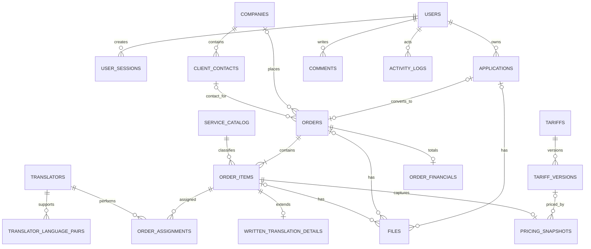

# Схема данных

## 1. Принципы

- PostgreSQL — источник истины; схема версионируется Alembic.
- Первичные ключи — UUID, публичный номер заказа — отдельная последовательность.
- Все даты хранятся как `timestamptz` в UTC.
- Деньги — `numeric(14,2)` плюс ISO-код валюты.
- У сущностей есть `created_at`, `updated_at`, а для архивируемых — `archived_at`.
- Изменения статуса и критичных полей сопровождаются записью `activity_logs` в той же транзакции.

## 2. Связи верхнего уровня

## 3. Core-таблицы

### `users`

`id`, `email`, `display_name`, `role` (`ADMIN|MANAGER`), `password_hash`, `is_active`, `must_change_password`, `two_factor_enabled`, зашифрованный `two_factor_secret_encrypted`, `last_login_at`, timestamps.

### `user_sessions`

`id`, `user_id`, `token_hash`, `expires_at`, `idle_expires_at`, `last_seen_at`, `ip_hash`, `user_agent`, `revoked_at`, timestamps. Индекс по `token_hash`; активные сессии удаляются/отзываются централизованно.

### `recovery_codes`

`id`, `user_id`, необратимый `code_hash`, `used_at`, `created_at`. Исходные recovery codes показываются один раз и в базу не попадают.

### `security_audit_events`

Phase 1 append-only foundation: actor/target, action, outcome, request/IP hashes, минимальные details и timestamp. Фиксирует входы, password/2FA operations и управление доступом; не подменяет будущий CRM activity log.

### `applications`

Сохраняет исходную заявку и результат обработки:

- исходный контракт: `name`, `contact_method`, `contact`, `requested_service`, `message`, `consent_accepted`, `consent_version`, `consent_at`, `source`, UTM-поля;
- технические поля: `public_request_id`, `idempotency_key`, `fingerprint`, `submitted_at`;
- обработка: `status_code`, `responsible_user_id`, `internal_summary`, `converted_order_id`, `converted_at`.

Исходные поля после приема не переписываются; нормализованные клиентские данные живут в `companies` и `client_contacts`.

### `companies`

`id`, `legal_name`, `display_name`, `tax_id`, `registration_number`, `billing_details` (`jsonb` для еще не согласованного состава реквизитов), `notes`, `archived_at`, timestamps. Автоматически объединять компании только по похожему имени нельзя.

### `client_contacts`

`id`, `company_id` nullable для частного клиента, `full_name`, `email`, `phone`, `messenger`, `position`, `is_primary`, `notes`, `archived_at`, timestamps.

### `orders`

`id`, `number` (уникальный `bigint` из sequence), `application_id` nullable/unique, `company_id` nullable, `contact_id` nullable, `responsible_user_id`, `status_code`, `title`, `received_at`, `agreed_due_at`, `completed_at`, `client_comment`, `internal_comment`, `archived_at`, timestamps.

Один заказ содержит одну или несколько позиций. Это отражает фактическую таблицу клиента, где один номер заказа повторяется для разных услуг.

### `order_items`

`id`, `order_id`, `service_code`, `sequence_no`, `source_language_code`, `target_language_code`, `quantity`, `unit_code`, `requested_due_at`, `agreed_due_at`, `status_code`, `client_comment`, `internal_comment`, timestamps. Уникальность `(order_id, sequence_no)`.

### `written_translation_details`

Расширение только для письменного перевода: `order_item_id`, `document_count`, `page_count`, `standard_page_count`, `character_count`, `theme`, `urgency_code`, `layout_required`, `certification_required`, `source_format`, `delivery_format`.

Поля для других типов услуг добавляются только после подтверждения их процессов.

## 4. Справочники и исполнители

### `service_catalog`

`code`, `name`, `description`, `is_active`, `sort_order`. Начальный список берется из подтвержденного каталога услуг публичного сайта, но утверждается клиентом перед seed.

### `status_catalog`

`scope` (`application|order|order_item|assignment`), `code`, `name`, `color_token`, `is_terminal`, `sort_order`, `is_active`. Набор статусов пока не фиксируется как бизнес-правило.

### `languages`

`code`, `name_ru`, `name_en`, `is_active`.

### `translators`

`id`, `full_name`, `email`, `phone`, `messenger`, `specializations`, `notes`, `is_available`, `archived_at`, timestamps. На MVP это внутренний справочник без кабинета переводчика.

### `translator_language_pairs`

`id`, `translator_id`, `source_language_code`, `target_language_code`, `proficiency_note`, `is_active`; уникальность по переводчику и паре.

### `order_assignments`

`id`, `order_item_id`, `translator_id`, `role_code`, `status_code`, `assigned_by`, `assigned_at`, `due_at`, `accepted_at`, `completed_at`, `fee_amount`, `fee_currency`, `comment`, timestamps.

## 5. Тарифы и финансы

### `tariffs` и `tariff_versions`

`tariffs`: идентичность тарифа (`code`, `name`, `service_code`, `is_active`).

`tariff_versions`: неизменяемая версия с `valid_from`, `valid_to`, `unit_code`, `base_rate`, `currency`, `rules_json`, `created_by`, timestamps. Новая цена создает версию, а не переписывает историю.

### `pricing_snapshots`

`id`, `order_item_id` unique, `tariff_version_id` nullable, `quantity`, `unit_code`, `base_rate`, `urgency_multiplier`, `discount_multiplier`, `subtotal`, `currency`, `calculation_details` (`jsonb`), timestamps.

Snapshot сохраняет использованные значения даже после изменения тарифа. Формулы и допустимые коэффициенты требуют подтверждения.

### `order_financials`

`order_id` unique, `subtotal`, `discount_amount`, `total_amount`, `currency`, `payment_method_code`, `invoice_number`, `invoice_issued_at`, `paid_at`, `payment_comment`, timestamps. Финансовые поля не вычисляются догадками до утверждения правил.

## 6. Файлы, комментарии, аудит

### `files`

`id`, ровно одна ссылка из `application_id|order_id|order_item_id`, `storage_key`, `original_name`, `mime_type`, `size_bytes`, `sha256`, `scan_status`, `uploaded_by`, `uploaded_at`, `deleted_at`. CHECK-ограничение требует ровно одного владельца файла.

### `comments`

`id`, ровно одна ссылка из `application_id|order_id|order_item_id`, `author_user_id`, `body`, `created_at`, `edited_at`, `archived_at`. Комментарий не подменяет аудит.

### `activity_logs`

Append-only: `id`, `actor_user_id` nullable для public/system, `entity_type`, `entity_id`, `action`, `request_id`, `before_json`, `after_json`, `created_at`. Из API нет обычного update/delete этого журнала.

## 7. Индексы и ограничения

- заявки: `(status_code, submitted_at desc)`, `(responsible_user_id, status_code)`, уникальный `idempotency_key` при наличии;
- заказы: уникальный `number`, `(status_code, agreed_due_at)`, `(responsible_user_id, status_code)`;
- позиции: `(order_id, sequence_no)`, `(status_code, agreed_due_at)`;
- назначения: `(translator_id, status_code, due_at)`;
- контакты: индексы по нормализованным email и телефону без автоматического merge;
- аудит: `(entity_type, entity_id, created_at desc)`;
- все внешние ключи имеют явную стратегию удаления; для рабочих сущностей преимущественно `RESTRICT`.

## 8. Миграция существующих Leads

Миграция должна быть повторяемой и идемпотентной:

1. выгрузить Leads из текущей базы;
2. преобразовать поля без потери исходных значений;
3. загрузить с сохранением исходного ID в `public_request_id`;
4. сверить количество и контрольные суммы ключевых полей;
5. повторно запустить в dry-run и убедиться в отсутствии дублей;
6. только после приемки переключить публичный endpoint.

Схема не предполагает прямой общей базы двух приложений.
