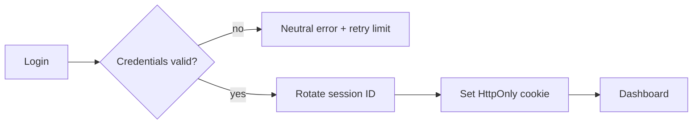
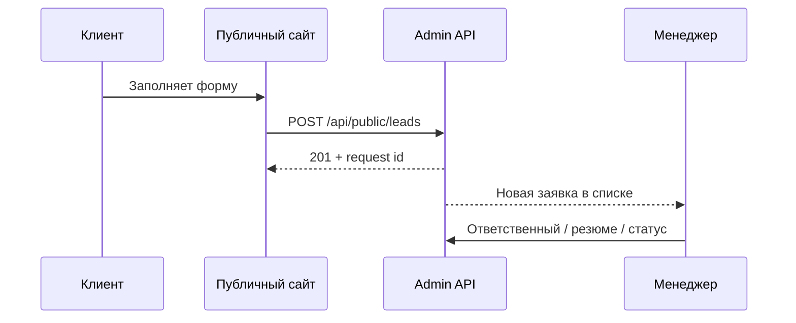

# Пользовательские сценарии

## 1. Вход и восстановление рабочей сессии

1. Сотрудник открывает `/login` и вводит email/пароль.
2. API проверяет лимит попыток, пароль и активность учетной записи.
3. Создается серверная сессия, браузер получает защищенную cookie.
4. Пользователь попадает на операционный обзор.
5. При истечении/отзыве сессии приложение сохраняет безопасный URL возврата и просит войти снова; несохраненные данные не считаются отправленными.

## 2. Новая заявка с публичного сайта

1. Клиент отправляет действующую форму сайта.
2. Public API валидирует согласие, обязательные поля и idempotency/fingerprint.
3. Заявка создается в исходном виде, в аудит пишется событие `application.created`.
4. Менеджер видит ее в начале списка и открывает карточку.
5. Менеджер назначает ответственного, уточняет задачу вне системы и записывает внутреннее резюме.
6. Заявка либо конвертируется в заказ, либо получает согласованный статус без физического удаления.

Если посетитель выбрал файл, тот же flow использует multipart endpoint; файл становится доступен сотруднику внутри карточки заявки и фиксируется в истории.

## 3. Конвертация заявки в заказ

1. Менеджер нажимает «Создать заказ» в карточке заявки.
2. Система предлагает выбрать существующую компанию/контакт или создать новые записи.
3. Менеджер проверяет услугу, языковую пару, сроки и добавляет одну или несколько позиций.
4. API в одной транзакции создает недостающие клиентские сущности и заказ, связывает заявку, записывает аудит.
5. Повторный запрос с тем же ключом не создает второй заказ.
6. Пользователь переходит в карточку созданного заказа.

Нечеткое совпадение имени или контакта показывается как подсказка, но не вызывает автоматическое объединение.

## 4. Ручное создание заказа

1. Менеджер открывает `/orders/new`.
2. Выбирает существующего клиента либо создает компанию/частный контакт.
3. Добавляет позиции услуг; для письменного перевода появляются подтвержденные профильные поля.
4. Указывает сроки и ответственного.
5. Перед сохранением backend валидирует ссылки и обязательные поля.
6. Создается номер заказа, начальный статус и запись аудита.

## 5. Работа с многоуслуговым заказом

1. В шапке карточки менеджер видит клиента, общий статус, сроки и итог.
2. Ниже отображаются независимые позиции с услугой, языковой парой, количеством и собственным статусом.
3. Менеджер добавляет/редактирует позицию без дублирования заказа.
4. Завершение позиции не обязано автоматически завершать весь заказ; правило определяется утвержденным workflow.
5. История показывает, кто и когда изменил общие или позиционные данные.

## 6. Назначение переводчика

1. Менеджер открывает позицию заказа.
2. Система фильтрует справочник по языковой паре и показывает доступные данные, не выбирая исполнителя автоматически.
3. Менеджер создает назначение, задает роль, срок и при наличии прав — гонорар.
4. API проверяет, что переводчик и позиция активны, сохраняет назначение и аудит.
5. Переназначение не удаляет историю: прежнее назначение закрывается согласованным статусом.

Кабинет и самостоятельное принятие задания переводчиком не входят в MVP.

## 7. Тариф и оплата

1. Менеджер выбирает утвержденную версию тарифа либо вводит разрешенное ручное значение.
2. Система показывает входные параметры расчета до подтверждения.
3. После подтверждения создается snapshot цены позиции.
4. Итоги заказа собираются из snapshots; скидка и платежные сведения сохраняются отдельно.
5. Изменение справочного тарифа не меняет цену уже согласованного заказа.
6. Изменение финансовых данных доступно только роли с соответствующим правом и всегда аудируется.

Формулы не реализуются до ответа клиента на финансовые вопросы.

## 8. Файлы

1. Авторизованный сотрудник выбирает файл в карточке заявки/заказа/позиции.
2. API проверяет права, лимит и тип и выдает намерение загрузки.
3. После загрузки создается запись `files` со статусом проверки.
4. До успешной проверки файл недоступен для обычного скачивания.
5. Скачивание требует повторной проверки прав и оставляет след в журнале.
6. Удаление следует согласованной политике хранения; в UI обычно используется архивирование.

Этот сценарий целевой и отложен до выбора storage и правил безопасности.

## 9. Комментарии и история

1. Комментарий прикрепляется к одной сущности и показывает автора/время.
2. Редактирование сохраняет событие в аудите; тихая перезапись истории невозможна.
3. Системная история формируется автоматически из значимых операций и не редактируется через UI.
4. Пользователь может отфильтровать историю карточки, но не удалить ее.

## 10. Архивирование

1. Пользователь с правом выбирает «Архивировать» и видит последствия.
2. Backend проверяет активные связи и правила роли.
3. Сущность получает `archived_at`, исчезает из стандартных списков и остается доступной через фильтр архива.
4. Событие фиксируется в журнале.
5. Восстановление доступно только там, где оно явно разрешено политикой.

## 11. Сбой и конфликт изменений

- API возвращает `request_id`, который можно передать поддержке.
- При сетевой ошибке интерфейс не показывает ложный успех.
- Для чувствительных форм используется версия/`updated_at`: если запись изменилась после открытия, пользователь получает конфликт и свежие данные вместо молчаливой перезаписи.
- Повторяемые create-операции используют idempotency key.
